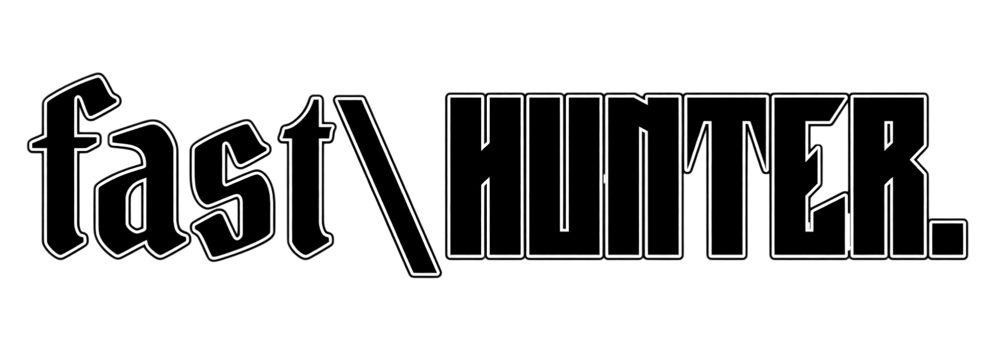
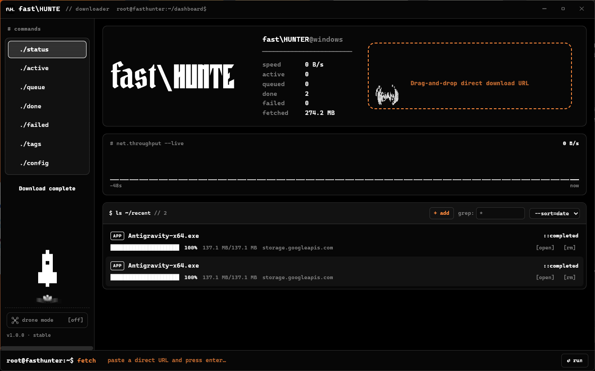
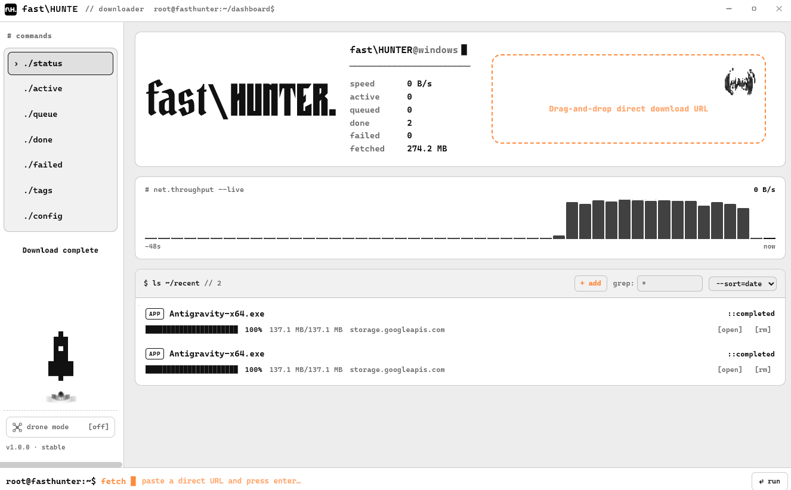
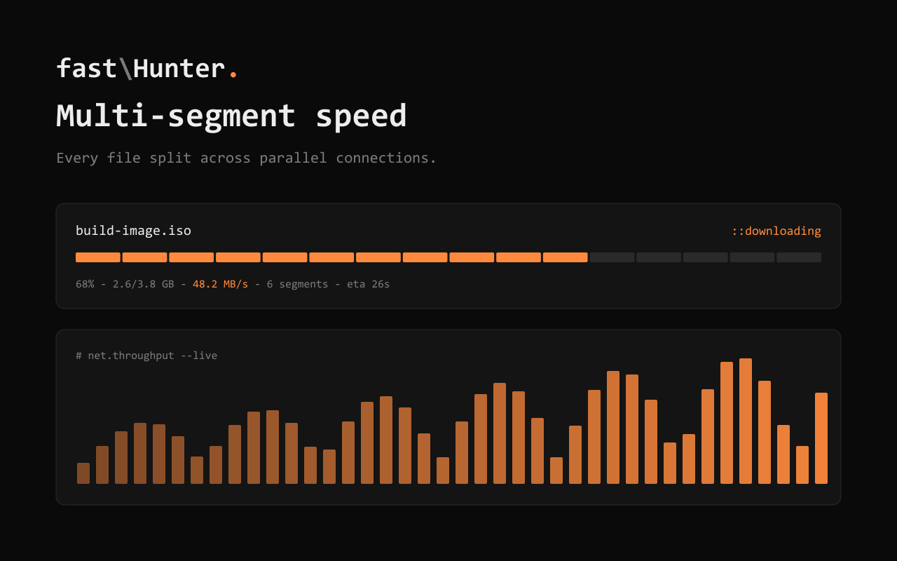
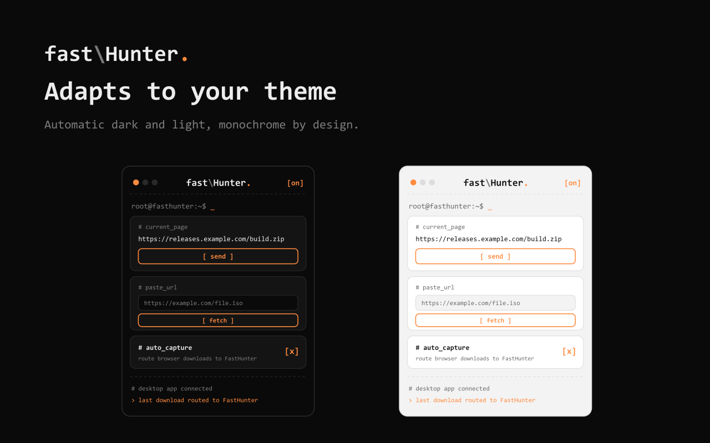
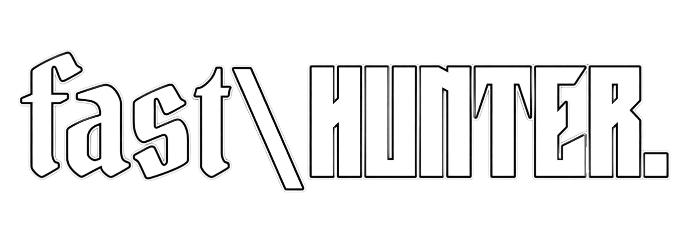

<p align="center">
  
</p>

<p align="center"><b>Hunt your downloads down.</b> ⚡</p>

<p align="center">
A terminal-styled Windows download manager that shreds files into parallel segments for full-speed, resumable downloads. Pair it with the browser extension to hijack any download in one click. Monochrome CLI UI, dark + light, system tray, drone mode — and a pixel bat that flaps while you fetch.
</p>

<p align="center">
  
  
  
  
  
</p>

<p align="center">
  
</p>

```console
root@fasthunter:~$ fetch --turbo https://releases.example.com/build.iso
> probing ......... ok   (ranges supported)
> splitting ....... 6 segments
> downloading ..... ############################  100%   48.2 MB/s
> merging ......... ok
> done.            ~/Downloads/build.iso
```

## ⌁ Why FastHunter

- **Segmented, multi-connection downloads** — every file is split across parallel connections to saturate your bandwidth.
- **Pause / resume / retry** — pick up exactly where you left off, no lost progress.
- **One-click browser capture** — the companion extension reroutes browser downloads to the desktop app (with your consent).
- **Smart categories** — auto-sorts video, audio, docs, images, archives, and apps.
- **Terminal-clean UI** — monospace, monochrome, automatic dark + light themes, orange accent.
- **Stays out of the way** — system tray, minimize-to-tray, and *drone mode* to cruise quietly in the background.
- **Private by design** — no accounts, no telemetry; links travel only between your browser and your own app over a local native-messaging bridge.

## ⌁ Screenshots

<p align="center">
  <br/>
  <sub>Automatic light theme — monochrome inverts, accent stays.</sub>
</p>

<p align="center">
  <br/>
  <sub>Per-segment progress and a live throughput graph.</sub>
</p>

## ⌁ Browser extension

<p align="center">
  
</p>

A Manifest V3 extension (Chrome / Edge / Brave) that matches the app's CLI look. It pings the desktop app, captures the current page or any pasted URL, and can auto-route browser downloads to FastHunter.

```console
browser  --enqueue-->  native host (com.fasthunter.downloader)  --add-url-->  FastHunter
```

Enable it from the desktop app: **Settings → `# [integration]` → `set_as_default_downloader`**, then paste your published Extension ID.

## ⌁ Architecture

```text
fasthunter/
├─ apps/
│  ├─ desktop/            # Electron shell + React (renderer) terminal UI
│  └─ browser-extension/  # Manifest V3 capture extension
├─ packages/
│  ├─ download-engine/    # segmented HTTP engine, queue, sql.js persistence
│  └─ shared-types/       # shared TypeScript contracts + URL validation
└─ scripts/               # icons, store assets, native-host registration
```

The renderer talks to the engine over Electron IPC. The browser extension talks to the app over a registered **native-messaging host** — the FastHunter executable itself, launched by the browser on demand.

## ⌁ Build from source

```console
root@fasthunter:~$ npm install
root@fasthunter:~$ npm run dev                 # run the desktop app in dev
root@fasthunter:~$ npm test                    # engine unit tests
root@fasthunter:~$ npm run package:windows     # portable .exe -> release/windows
root@fasthunter:~$ npm run build:extension     # unpacked extension -> apps/browser-extension/dist
root@fasthunter:~$ npm run zip:extension       # store zip -> release/
```

> Requires Node.js 20+. Windows is the primary target (native messaging registration and packaging are Windows-first).

## ⌁ License

[MIT](LICENSE) — use it, fork it, ship it. Just keep the copyright.

<p align="center">
  
</p>
